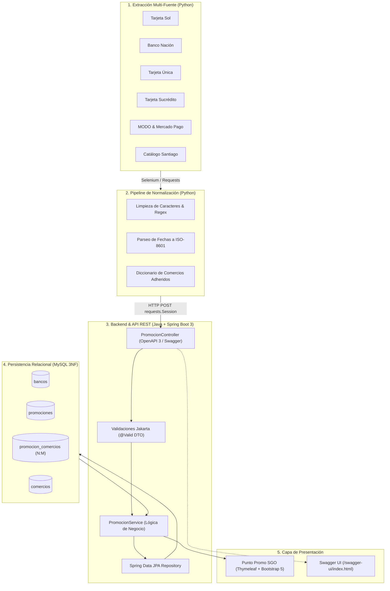

# 🚀 Punto Promo SGO — Plataforma Web, API REST & Pipeline ETL


-4479A1?logo=mysql&logoColor=white)


> **Plataforma integral para la centralización, filtrado dinámico y consulta de promociones bancarias y beneficios comerciales en Santiago del Estero y La Banda.**

Este proyecto combina una **arquitectura Backend robusta en Java (Spring Boot 3)** con un **Pipeline de Ingeniería de Datos (ETL) en Python**. Su propósito es automatizar la extracción de beneficios financieros dispersos en portales oficiales, normalizarlos en una base de datos relacional y exponerlos a través de una API REST documentada y una interfaz web interactiva.

---

## 🏗️ Arquitectura General del Sistema



---

## ☕ Módulo Backend (Java 17 + Spring Boot 3)

Desarrollado bajo **arquitectura en capas desacoplada** (Controlador, Servicio, Repositorio, DTO y Mapeadores).

### 🛠️ Tecnologías del Backend
* **Lenguaje:** Java 17 (LTS)
* **Framework:** Spring Boot 3.5.x
* **Acceso a Datos:** Spring Data JPA / Hibernate
* **Base de Datos:** MySQL 8 (Normalización 3NF con índices estratégicos)
* **Documentación:** SpringDoc OpenAPI 3.1 & Swagger UI
* **Validación:** Jakarta Validation (Bean Validation)
* **Frontend Integrado:** Thymeleaf + Bootstrap 5 (Server-Side Rendering con persistencia de filtros)
* **Testing:** JUnit 5, Mockito

### ✨ Funcionalidades y Decisiones Técnicas
1. **Documentación Viva con Swagger:** Todos los endpoints y contratos DTO están anotados con `@Tag`, `@Operation`, `@Schema` y `@ApiResponses`, accesibles interactivamente desde `/swagger-ui/index.html`.
2. **Filtrado Dinámico y Paginación Eficiente:** Búsqueda combinada por entidad bancaria (`bancoId`), categoría comercial (`categoria` Enum) y estado de vigencia, implementada con `Pageable` para optimizar el rendimiento.
3. **Validación Estricta de Contratos (DTO Pattern):** La API protege la integridad de los datos mediante validaciones automáticas (`@NotBlank`, `@NotNull`, `@FutureOrPresent`, `@Valid`).
4. **Manejo Global de Errores:** Centralizado con `@RestControllerAdvice` y `@ExceptionHandler`, garantizando respuestas JSON estructuradas con códigos HTTP estándar (`400 Bad Request`, `404 Not Found`, `409 Conflict`).

---

## 🗄️ Modelo Relacional de Base de Datos (MySQL)

El modelo de datos fue diseñado bajo **Tercera Forma Normal (3NF)**:
* **`bancos` (1:N `promociones`):** Almacena las entidades emisoras (bancos tradicionales, tarjetas regionales, billeteras virtuales).
* **`promociones` (N:M `comercios`):** Relacionadas mediante la tabla asociativa intermedia **`promocion_comercios`**.
* **Índices de Alto Rendimiento:**
  * `idx_promo_banco_cat` (`banco_id, categoria`): Acelera las búsquedas compuestas más frecuentes.
  * `idx_promo_fecha_fin` (`fecha_fin`): Optimiza la depuración de promociones vencidas.
  * `idx_comercio_nombre` (`nombre`): Agiliza la búsqueda por comercio.

---

## 🐍 Módulo de Automatización & Data Pipeline (Python ETL)

Pipeline de ingeniería de datos encargado de extraer, normalizar y cargar la información sin intervención manual.

### 🛠️ Tecnologías
* **Python 3.x**
* **Selenium WebDriver:** Navegación en páginas dinámicas (SPA con JavaScript).
* **Requests (`Session`):** Comunicación HTTP con pool de conexiones hacia la API REST.
* **Regex & Datetime:** Normalización de fechas heterogéneas a formato SQL (`YYYY-MM-DD`).

### 🔄 Fases del Pipeline
1. **Extracción Multi-Fuente (`Fuentes/`):**
   * Automatización sobre 7 portales: *Tarjeta Sol, Banco Nación, Tarjeta Única, Tarjeta Sucrédito, MODO, Mercado Pago y Catálogo Santiago*.
2. **Normalización (`normalizacion/procesador.py`):**
   * Estandarización de rubros comerciales.
   * Cruce con `diccionario_comercios.py` para unificar nombres de locales adheridos.
3. **Carga e Ingesta HTTP (`carga/cargar_datos.py`):**
   * Envío en lote vía `requests.Session()` a la API REST (`POST /api/v1/promociones`).
   * Manejo inteligente de respuestas (`201 Created` vs `409 Conflict` por duplicados).
   * Generación de reporte de auditoría: `resumen_carga.json`.

---

## 📡 Referencia de la API REST

| Método | Endpoint | Descripción | Parámetros Clave |
| :--- | :--- | :--- | :--- |
| `GET` | `/api/v1/promociones` | Listado paginado con filtros dinámicos | `bancoId` (Long), `categoria` (Enum), `page`, `size` |
| `POST` | `/api/v1/promociones` | Ingesta y creación de una nueva promoción | `PromocionDTO` (JSON validado en el body) |
| `GET` | `/api/v1/promociones/{id}` | Consulta de promoción por ID | `id` (Path variable) |
| `GET` | `/v3/api-docs` | Especificación OpenAPI 3.1 en JSON | — |
| `GET` | `/swagger-ui/index.html` | Interfaz interactiva de Swagger UI | — |

---

## 🚀 Instalación y Puesta en Marcha

### Requisitos Previos
* **Java JDK 17+**
* **Maven 3.8+**
* **MySQL 8.0+**
* **Python 3.8+** y Google Chrome

### 1. Configuración de Variables de Entorno
Configurá las credenciales en tu entorno local o IDE (*Run/Debug Configurations*):

| Variable | Descripción | Ejemplo |
| :--- | :--- | :--- |
| `DB_URL` | URL de conexión JDBC a MySQL | `jdbc:mysql://localhost:3306/promohub_sde?serverTimezone=UTC` |
| `DB_USER_NAME` | Usuario de base de datos | `root` |
| `DB_PASSWORD` | Contraseña de base de datos | *(Tu contraseña o vacío)* |

### 2. Ejecutar el Backend (Java)
```bash
# Clonar el repositorio
git clone https://github.com/AFigueroaAgustin/PromosHubSGO.git

# Ingresar al directorio
cd backend

# Ejecutar con Maven
./mvnw spring-boot:run
```
* La aplicación web estará disponible en: `http://localhost:8080`
* La documentación Swagger UI en: `http://localhost:8080/swagger-ui/index.html`

### 3. Ejecutar el Pipeline ETL (Python)
```bash
cd ../WebScrapingPromos

# Instalar dependencias
pip install selenium requests beautifulsoup4

# Ejecutar extracción y carga completa
python main.py
```

---

## 👤 Autor

**Agustín Eduardo Figueroa**  
*Desarrollador Backend · Santiago del Estero, Argentina*

* 🌐 [Portafolio Web](https://afigueroaagustin.github.io/Portafolio-FigueroaAgustin/)
* 💼 [LinkedIn](https://www.linkedin.com/in/agustinfigueroa390/)
* 🐙 [GitHub](https://github.com/AFigueroaAgustin)
* 📩 [agustinfigueroa390@gmail.com](mailto:agustinfigueroa390@gmail.com)
